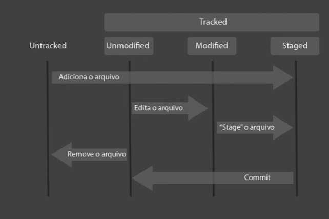

# Notas e comandos para lembrar no GIT

- git init
- git status
- git add
- git commit
- git remote add origin
- git pull
- git stash 
- git stash pop
- git log
- git reset
- git revert
- git restore
